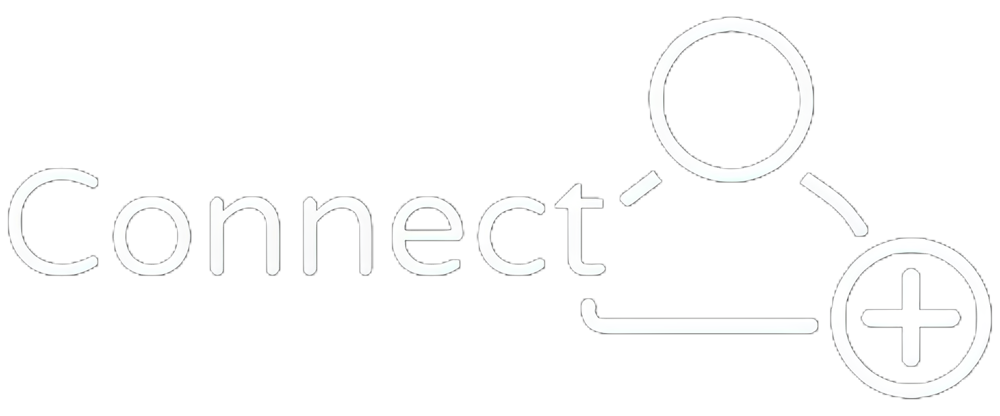

# FullStack_Challenge

<h1 align="center">
    
</h1>

## 📃Conteúdos da Página:

-   [Sobre](#Sobre)
-   [Instalação](#Instalação)
-   [Desenvolvedores](#Feito-com-🤍-por)

## 📜Sobre

Este projeto envolve o desenvolvimento de uma plataforma de gerenciamento de clientes, que permite a criação de um cadastro detalhado e organizado de clientes e seus respectivos contatos. Cada cliente pode ter diversos contatos associados, como gerentes, compradores e fornecedores, possibilitando um controle preciso e eficiente do relacionamento com parceiros de negócios.

Ademais, a plataforma disponibiliza a funcionalidade de geração de relatórios em formato PDF, contendo todas as informações pertinentes a cada cliente e seus respectivos contatos.

## 💾Instalação

# Back-end:

1. Certifique-se de ter o Node.js instalado na sua máquina. Se você ainda não tem o Node.js instalado, baixe e instale-o em https://nodejs.org.

2. Clone o repositório do projeto.

3. Abra um terminal na pasta "BACKEND" do projeto clonado e execute o comando npm install. Este comando irá instalar todas as dependências necessárias para a execução da API.

4. Verifique as configurações do arquivo .env e certifique-se de que todas as informações necessárias estão corretamente configuradas.

5. Execute o comando npm start na pasta raiz do projeto para iniciar a API.

6. Aguarde até que a API esteja pronta para uso. A saída do comando npm start deve mostrar a mensagem "Server listening on port 3001".

7. Se a API estiver rodando corretamente, você pode testá-la acessando-a no navegador ou utilizando uma ferramenta de teste de API, como o Insomnia.

# Front-end:

1. Certifique-se de ter o Node.js instalado na sua máquina. Se você ainda não tem o Node.js instalado, baixe e instale-o em https://nodejs.org.

2. Clone o repositório do projeto.

3. Abra um terminal na pasta "frontend" do projeto clonado e execute o comando npm install. Este comando irá instalar todas as dependências necessárias para a execução da aplicação.

4. Execute o comando npm run dev na pasta raiz do projeto para iniciar a aplicação em modo de desenvolvimento.

5. Aguarde até que a aplicação esteja pronta para uso. A saída do comando npm run dev deve mostrar a mensagem "Ready on http://localhost:3000".

6. Abra o navegador e acesse a URL http://localhost:3000 para visualizar a aplicação em execução.

## Feito com 🤍 por:

-   Enzo Machado  
